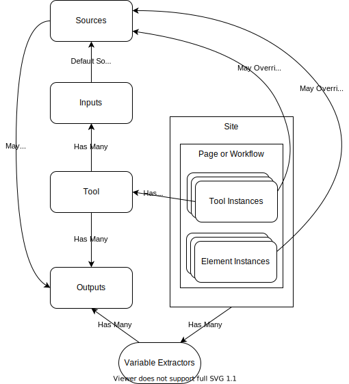

# General Terminology

* `Page`: A page within Kenchi, very similar to a workflow but categorized differently in that it's used for more interactivity, e.g. navigation, whereas a workflow is used more for providing content. Under the hood there's no material distinction: they both have ~the same capabilities.
* `Domain`: The place where Kenchi is being run, e.g. Intercom.
* `Element`: A piece of UI/functionality defined by Kenchi that can be inserted into a workflow or page. This includes all on-page UI and formatting (lists, search boxes, headers, images, etc). *Note*: React and Slate both have their own notion of Element that's different from this.
* `Tool`: Something that performs actions or provides UI/interactivity, possibly in response to site context. Tools are distinct from elements in that they provide extra configuration and customization: while elements are mostly defined by Kenchi and used for building page functionality, tools are much more customizable. As a result tools are defined from "tool components", whereas elements are hard-coded by Kenchi. *Note*: this distinction isn't super crisp. The main different from an architecture standpoint is that tools are dynamically defined in the DB from a component, giving them 2 layers of customization (tool component => tool and tool => tool instance), whereas elements go straight into the page with any customization defined in their instance (element => element instance).
* `Automation`: A kind of tool that provides no advanced UI, only a button to activate itself.
* `Tool Component`: A type of tool, can be thought of as an abstract tool. For example, "OpenURLs" is a component that currently exists. These are turned into a reusable tool by setting some configuration on them, so one would create a "Open admin page for user" tool from the "OpenURLs" component. *Note*: React has its own notion of Component that's different from this.
* `(Element|Tool) Instance`: The specific use of an element or tool on a page. For example, when you insert an image into a page, that is an instance of that image. This instance contains its own specific configuration that's non-reusable (in the image example the URL of the image).

# Data-Passing Terminology

* `KD`: Stands for "Kenchi Data", the prefix by which we reference all variable passing types
* `Variable`: A piece of information passed to, from, or between a site, page, element, or tool.
* `Input Variable`: A variable that a tool or element needs to function.
* `Input Source`: A description of where an input comes from. There are 3 kinds of sources:
  * `default`: A hard-coded value.
  * `output`: The output of a tool, element, or site
  * `form`: The value is prompted for from the user. Kenchi automatically handles asking for these values and passing them into the tool.
* `Output Variable`: A variable provided by the tool or element. This can either be local (i.e. another tool wishing to use it as an input needs to specifically reference this tool) or site-wide (e.g. if a tool is augmenting or filling in things like email address).

*Open question*: what is the right naming for "site-wide" variables. Possible concepts include site-wide (primarily provided by and oriented around the site you're on, implies they're primarily meant for use in the extension), page-wide (in service of the page and its content), or global. My gut says page but since I'm not 100% thrilled with the page/site terminology it seems worth punting until concepts like that are resolved.



## Prototype Typescript types

```ts
type ToolComponent<P = {}> = {
  name: string, // unique
  description: string,
  icon: IconDefinition,
  reactElement: React.ComponentType<P>,
  props: P, // Special props: execute
}

type Tool = {
  __typename: 'Tool',
  id: string,
  staticId: string,
  name: string,
  description: string,
  component: string,
  inputs: KDInput[],
  outputs: KDOutput[],
  configuration: ToolConfig,
}

type ToolInstance = {
  type: 'tool',
  tool: string, // Tool staticId
  sources?: Record<string, TCSource[]>, // Mapping from TCInput.name to override for defaultSources
  children: [{text: ''}], // Required to be a Slate Element
}

enum KDType {
  int = 'int',
  string = 'string',
  boolean = 'boolean',
};

type KDInput = {
  name: string,
  description?: string,
  type: KDType,
  defaultSources?: KDDefaultSource[],
}

type KDOutput = {
  name: string,
  description?: string,
  type: KDType,
}

type KDDefaultSource = KDSourceOutputPage | KDSourceForm | KDSourceDefault;
type KDSource = KDSourceOutput | KDSourceForm | KDSourceDefault;

enum KDSourceKind {
  form = 'form',
  output = 'output',
  default = 'default',
}

type KDSourceOutput = {
  kind: KDSourceKind.output,
  from: string, // 'page' or some static tool instance ID
  name: string,
}

type KDSourceOutputSite = {
  kind: KDSourceKind.output,
  from: 'site',
  name: string,
}

type KDSourceForm = {
  kind: KDSourceKind.form,
  // type: 'text', // | 'select' | 'checkbox' ???
  placeholder: string,
}

type KDSourceDefault = {
  kind: kDSourceKind.default,
  name: string,
}

type SlateConfig = {
  slate: true,
  rich: boolean,
  singleLine: boolean,
  children: Node[], // Slate Node
}

type ToolConfigChild = ToolConfig | SlateConfig | string | boolean | ToolConfigChild[];

type ToolConfig = {
  [key: string]: ToolConfigChild
}
```
